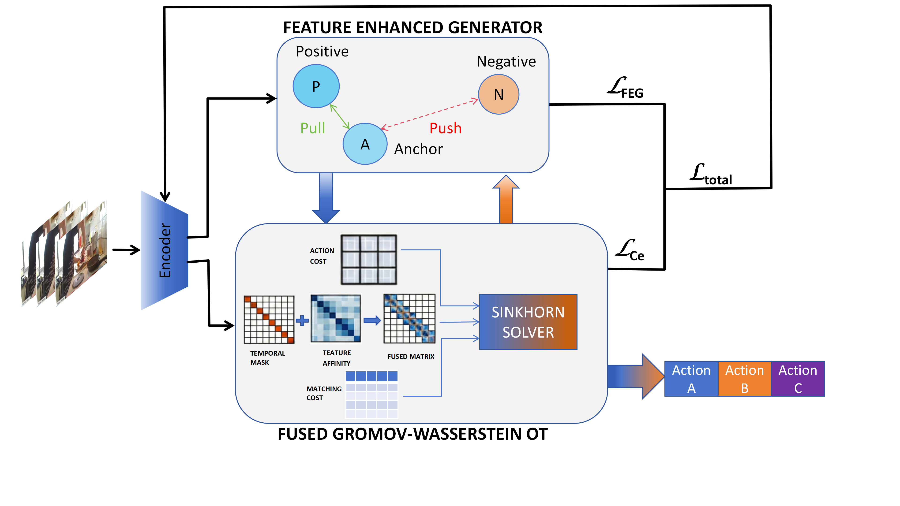

# FIS-OT: Feature-Induced Optimal Transport for Unsupervised Action Segmentation

This repo contains the implementation of **FIS-OT** (Feature-Induced Optimal Transport), a method for unsupervised action segmentation. It builds upon the ASOT (Action Segmentation Optimal Transport) framework and introduces a **Feature Enhanced Generater (FEG)** module to enhance feature learning and segmentation performance.

## Overview

FIS-OT improves unsupervised action segmentation by incorporating:
1.  **Feature Enhanced Generater (FEG)**: A module that leverages both temporal structure and semantic similarity to refine feature representations.
2.  **Feature-Induced Optimal Transport**: Utilizing enhanced features to guide the optimal transport process for better pseudo-label generation.

## Dependencies

The following packages are required:
*   `numpy`
*   `scipy`
*   `scikit-learn`
*   `matplotlib`
*   `torch` (PyTorch)
*   `pytorch-lightning`
*   `wandb` (Weights & Biases for logging)

## Dataset Preparation

The data directory should have the following structure:

```
data/
├── Breakfast/
│   ├── groundTruth/
│   ├── features/
│   └── mapping.txt
├── 50Salads/ (or FS/FSeval)
│   ├── groundTruth/
│   ├── features/
│   └── mapping.txt
└── desktop_assembly/
    ├── groundTruth/
    ├── features/
    └── mapping.txt
```

Ensure that `data_path` in the shell scripts points to your actual data root (e.g., `/opt/data/private/action_seg_ot/data`).

## Usage

We provide shell scripts to run experiments on different datasets. These scripts use `src/train_feg_asot.py` which includes the FEG module.

### Breakfast Dataset
Run the `run_bf.sh` script to train on the Breakfast dataset. This script iterates through different action classes and runs the training pipeline.
```bash
./run_bf.sh
```
*Note: This script also runs `calc_bf_auto.py` at the end to calculate and print the weighted average metrics.*

### 50 Salads Dataset
Run the `run_fs.sh` script for the 50 Salads dataset.
```bash
./run_fs.sh
```

### Desktop Assembly Dataset
Run the `run_da.sh` script for the Desktop Assembly dataset.
```bash
./run_da.sh
```

### FSeval (50 Salads Evaluation Split)
Run the `run_fseval.sh` script for the FSeval experiment.
```bash
./run_fseval.sh
```
.png)
## Key Arguments
The main training script `src/train_feg_asot.py` accepts several arguments:
- `-p`, `--path`: Path to the data directory.
- `-d`, `--dataset`: Dataset name (e.g., `Breakfast`, `FS`, `desktop_assembly`).
- `-ac`, `--activity`: Specific activity to train on (or `all`).
- `--feg-weight`: Weight for the FEG loss.
- `--feg-h`: Bandwidth parameter for the semantic kernel in FEG.
- `--feg-warmup`: Number of warmup epochs for FEG.
- `-km`, `--use-kmeans-init`: Use KMeans for initialization.
**<span style="color:red">Espeicially, the wight of Cv_feat can be setted in line 161 of asot.py.</span>**
## Monitoring
Training logs and metrics are logged to [WandB](https://wandb.ai/). Ensure you have set up your WandB account and logged in.
Local logs for Breakfast dataset are saved in the `bf_logs` directory.

## Acknowledgements
This codebase is based on the [ASOT](http://arxiv.org/abs/2404.01518) implementation.
